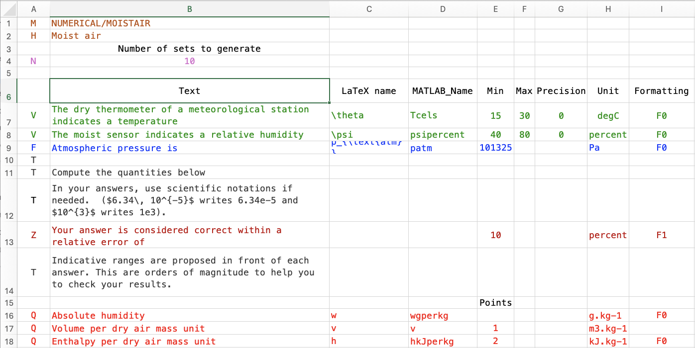
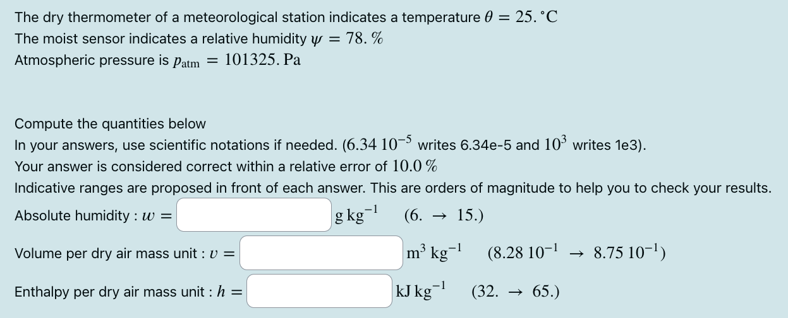

## Name
OLMOODLE : a MATLAB suite to easily create calculated numerical questions in moodle.

## Description
OLMOODLE is a MATLAB suite to easily create [calculated numerical questions in moodle](https://docs.moodle.org/500/en/Calculated_question_type), avoiding the painful and limited syntax proposed by moodle to compute the correct result in function of input data. The aim of the present code is to generate N identical cloze questions with different numerical datasets. It requires MATLAB, and a standard installed LaTeX suite.

The main script takes an Excel file on input, whose shape is very similar to the final question, with some additional syntax to describe the datasets, the display of the questions and the matlab variables names coding the inputs and outputs . From the info found in Excel file, the script prebuilds a MATLAB snippet that the user must complete to compute the correct answers to questions. From there the script creates N different cloze questions, coded in LaTeX following the syntax of the LaTeX "moodle" package (installed by default on most LaTeX distributions). The output LaTeX file must be then compiled with xelatex, and the output xml file is ready to be uploaded in moodle.

## Visuals
Example images

## Installation
You will generally install in a subpath of your personal main matlab folder (for example `/home/albert/matlab`), but it can be anywhere. Go to that directory and get the files. If you downloaded the code through git, you're ready to carry on. If you downloaded a .tgz archive, uncompress it here.

Now, you must say to matlab where are the olmoodle MATLAB scripts and functions. Let's admit you installed in `/home/albert/matlab`. 
- open MATLAB
- in the MATLAB main window go to the "HOME" tab
- click on "set path"
- in the appearing "Set path" window, click on "Add Folder"; travel through your folders and go to `/home/albert/matlab/olmoodle/mfiles` and click "Open".
- reclick on "Add Folder" and in a similar manner, add `/home/albert/matlab/olmoodle/mfiles/utils`.
- in the "Set path" window click "Save"
You should now have access to the code. In the matlab command window, type "`olmoodle_test`". If installation is correct, you should have the following answer:
_OLMOODLE is here ! _

## Usage
- Create a void directory somewhere, and there create your Excel file, say "`myquestion.xls`"
- In MATLAB, go to that directory, and launch "`olmoodle_main`"
- An input filename will be asked. Answer "`myquestion.xls`" **(with extension)**. In the following calls, if any, the latter will be proposed by default.
- On the first run, if no errors are detected, you'll be informed that a mycode.m snippet program has been created, and it will be opened in MATLAB editor. The script is paused.
- Fill the snippet code to program the correct answers to the questions. The comments in the snippet will guide you. **Don't forget to use .*, ./ and .^ in multiplications, divisions and exponentiations**, respectively.
- Once you are done, click ENTER in the Command Window. The main script will build the output LaTeX file "`myquestion.tex`".
- In a terminal, or in your favorite LaTeX system type "`xelatex myquestion`"
- A file "`myquestion-moodle.xml`" has been created. Import it into moodle. You're done !

## Support
Contact me at olivier(dot)louisnard(at)mines-albi(dot)fr

## Roadmap

## Contributing
You can contribute to improve packaging, documentation, and internationalisation.

## License
Open source, but still don't know in which way.

## Project status
Starting...
